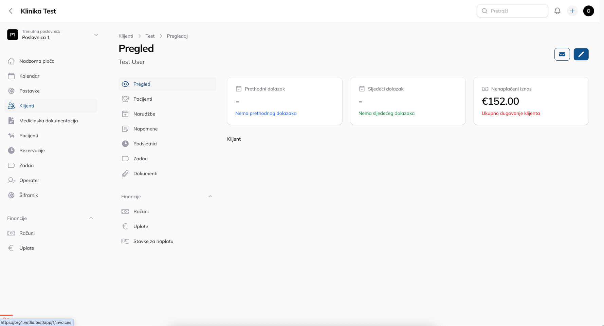

<p align="center">
  <!-- LOGO PLACEHOLDER -->
  
</p>

[](LICENSE)

# Vetlio

A modern, multi-tenant CRM for veterinary practices — scheduling clients & patients, invoicing, medical documents, offers, orders, and more. Built with **Laravel 12** and **Filament 4.1**.

> WARNING: **Alpha Stage** — not production ready. Expect breaking changes and incomplete features.

<p align="center">
  <!-- SCREENSHOT PLACEHOLDERS -->
  
</p>

---

## Features

* Appointments: clients & patients, slot availability, reminders
* Billing: invoices, items, taxes, payments
* Medical docs: findings, attachments, print/PDF
* Multi‑tenancy (SaaS)
* Role & permission model (per user / per location)
* Search, filters, exports, PDF prints

## Tech Stack

* **Laravel 12**, PHP 8.3+
* **Filament 4.1** (panels, resources, actions)
* MySQL/MariaDB, Redis (cache/queue)
* Pest for tests
* Docker/Sail (optional)

---

## Quick Start

### Prerequisites

* PHP 8.3+, Composer
* Node 20+, PNPM/NPM
* MySQL 8+ (or MariaDB 10.6+), Redis
* (Optional) Docker & Docker Compose

### 1) Clone & install

```bash
git clone https://github.com/lukacavic/vetlio.git
cd vetlio

composer install
cp .env.example .env
php artisan key:generate
```

### 2) Configure `.env`

Set at least the following variables:

```env
APP_NAME="Vetlio"
APP_ENV=local
APP_URL=shttp://vetlio.test

DB_CONNECTION=mysql
DB_HOST=127.0.0.1
DB_PORT=3306
DB_DATABASE=vetlio
DB_USERNAME=root
DB_PASSWORD=

CACHE_DRIVER=redis
QUEUE_CONNECTION=redis
SESSION_DRIVER=file

FILESYSTEM_DISK=public

# Mail
MAIL_MAILER=smtp
MAIL_HOST=127.0.0.1
MAIL_PORT=1025
MAIL_FROM_ADDRESS="noreply@vetlio.test"
MAIL_FROM_NAME="Vetlio"

```

### 3) Database & storage

```bash
php artisan migrate --seed   # seeds demo data if available
php artisan storage:link
```

### 4) Assets & dev server

```bash
npm install
npm run dev
```

### 5) Run app

```bash
php artisan serve
# queues & scheduler
php artisan queue:work
# Add cron: * * * * * php /path/to/artisan schedule:run >> /dev/null 2>&1
```

---

## Testing

```bash
php artisan test
# or
vendor/bin/pest
```

* Add feature tests for tenancy scoping and permissions.

---

## Security

If you discover a security vulnerability, please email **[security@yourdomain.tld](mailto:security@yourdomain.tld)**. We will promptly address the issue.

---

## Contributing

1. Fork & create a feature branch
2. Run tests and static analysis
3. Open a PR with a clear description & screenshots (if UI)

Code style: `vendor/bin/pint` · Static analysis: `vendor/bin/phpstan analyse`

---

## Roadmap

* [ ] Advanced availability (buffers, resources)
* [ ] E‑invoice integrations
* [ ] Google Calendar sync
* [ ] SMS/Email templates & flows
* [ ] Translations (EN, HR, …)

---

## Notes

* Cron: `* * * * * php artisan schedule:run`
* Queues: `php artisan queue:work` (or Supervisor in prod)
* Storage: `php artisan storage:link`

